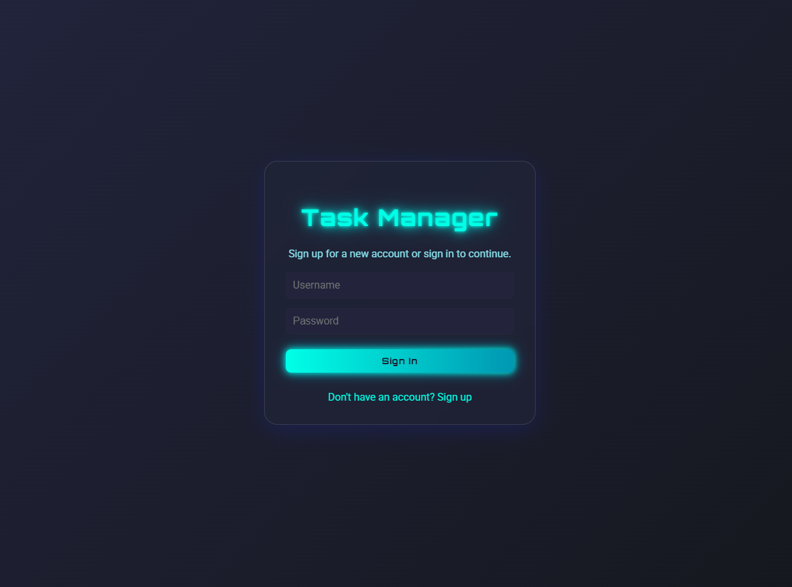
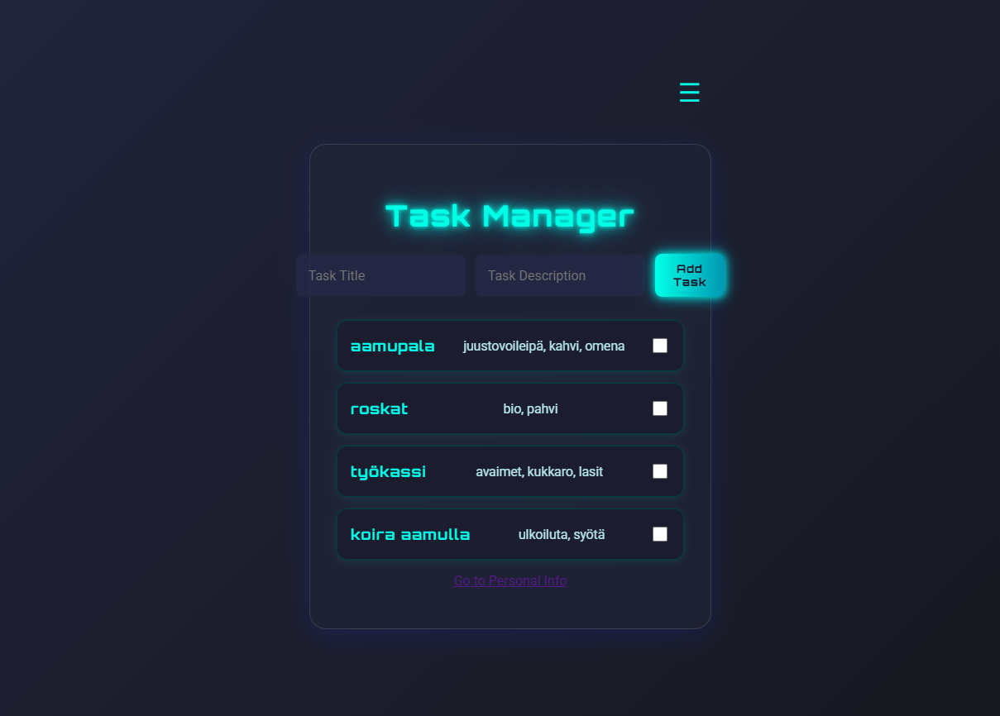
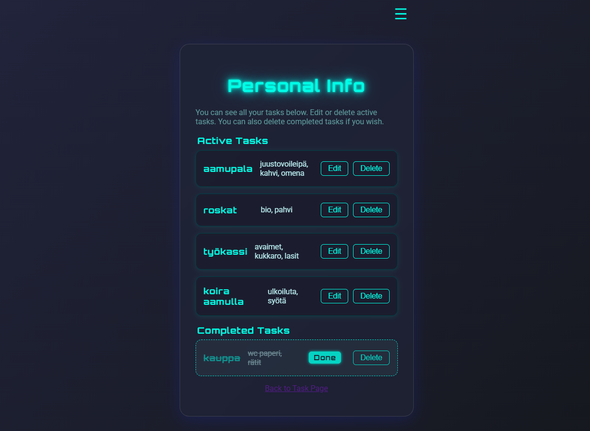
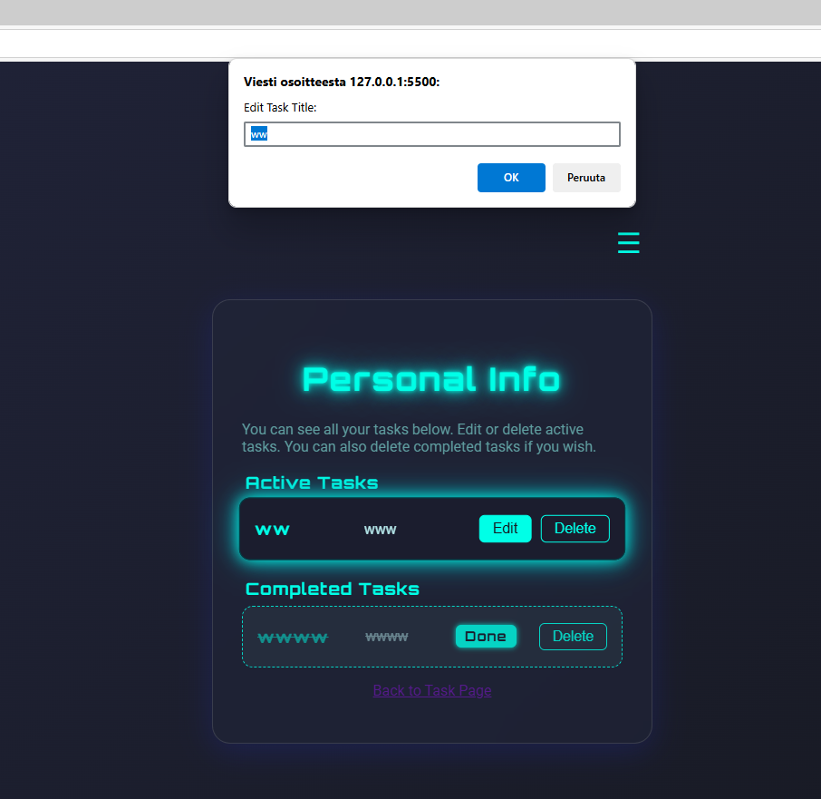
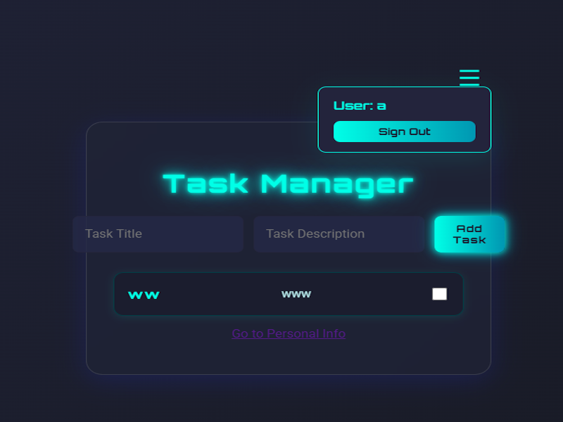

# Johdanto

Tämä työ keskittyy selainpohjaisen to do -sovelluksen kehittämiseen, jonka tavoitteena on helpottaa käyttäjien arkea tehtävien hallinnan avulla. Monet ihmiset käyttävät erilaisia muistilappuja, kalentereita ja sovelluksia pitääkseen kirjaa tehtävistään, mikä voi olla aikaa vievää ja sekavaa. Tämän to do -sovelluksen avulla käyttäjä voi keskittää kaikki tehtävänsä yhteen paikkaan, mikä helpottaa tehtävien hallintaa, seurantaa ja priorisointia.

Sovellus on suunniteltu vastaamaan käyttäjien tarpeisiin tarjoamalla selkeän ja käyttäjäystävällisen käyttöliittymän sekä helpon tavan lisätä, muokata, merkitä tehdyksi ja poistaa tehtäviä. Sovelluksen avulla käyttäjä voi parantaa omaa ajanhallintaansa ja vähentää unohduksia.

## **Sovelluksen keskeiset toiminnot:**

* Tehtävien lisääminen ja hallinta
* Tehtävien muokkaaminen ja poistaminen
* Tehtävien merkitseminen tehdyksi
* Käyttäjäkohtainen kirjautuminen ja omien tehtävien näkymä
* Selkeä ja responsiivinen käyttöliittymä

## **Tavoitteet**

Tämän to do -sovellusprojektin tavoitteena on:

* **Käyttäjän näkökulmasta:**
  * Helpottaa arjen ja työn tehtävien hallintaa
  * Parantaa ajanhallintaa ja vähentää unohduksia
  * Tarjota helppokäyttöinen ja turvallinen tehtävienhallintatyökalu

* **Henkilökohtaiset tavoitteet:**
  * Syventää ymmärrystä web-sovellusten kehittämisestä
  * Harjoitella Node.js-, Express- ja SQLite-teknologioiden käyttöä
  * Kehittää projektinhallinta- ja käyttöjärjestelmiä

## 🗓 Ulkonäkö 

