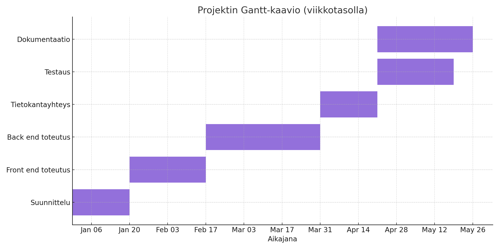

# Suunnitelma projektin toteuttamiseksi

## Asiakkaan tarpeet ja suunnittelun raamit

### Kohderyhmä

Kohderyhmänä ovat kaikki, jotka haluavat hallita omia tehtäviään digitaalisesti – opiskelijat, työntekijät, yrittäjät ja arjen kiireiset ihmiset.

### Aiemmat ratkaisut ja muutos

**Nykytila:** Käyttäjät hallitsevat tehtäviään eri sovelluksissa, paperilla tai muistilapuilla. Tämä johtaa helposti tehtävien unohtamiseen ja tehottomaan ajankäyttöön.

**Uusi ratkaisu:** To do -sovellus kokoaa kaikki tehtävät yhteen paikkaan, mahdollistaa niiden muokkaamisen, merkitsemisen tehdyksi ja poistamisen sekä tarjoaa selkeän ja responsiivisen käyttöliittymän.

## Tavoitteet

Sovelluksen tavoitteena on:

1. **Vähentää arjen kaaosta:**
   - Keskittää kaikki tehtävät yhteen paikkaan.
   - Mahdollistaa tehtävien nopean lisäämisen, muokkaamisen ja poistamisen.
   - Vähentää unohduksia ja parantaa ajanhallintaa.

2. **Parantaa käyttäjäkokemusta:**
   - Tarjota selkeä ja helppokäyttöinen käyttöliittymä (saavutettavuuden testaus WebAim).
   - Mahdollistaa tehtävien merkitseminen tehdyksi ja niiden erottelu aktiivisiin ja valmiisiin.

3. **Turvallisuus ja yksityisyys:**
   - Käyttäjäkohtainen kirjautuminen ja omien tehtävien näkymä.
   - Tietojen tallennus turvallisesti tietokantaan.

## Toiminnallisuudet ja tekniset ratkaisut

**Käyttäjäpuolen toiminnot:**

- Rekisteröityminen ja kirjautuminen
- Tehtävien lisääminen, muokkaaminen, merkitseminen tehdyksi ja poistaminen
- Aktiivisten ja valmiiden tehtävien erottelu
- Käyttäjäkohtainen tehtävälista

**Tekniset ratkaisut:**

- **Backend:** Node.js & Express
- **Tietokanta:** SQLite
- **Frontend:** EJS, HTML, CSS, JavaScript
- **Autentikointi:** express-session ja bcrypt
- **Responsiivisuus:** CSS

| Toiminnallisuus | Tekninen toteutus | Syy |
|---|---|---|
| Tehtävien hallinta | REST API, SQLite | Tehokas ja turvallinen tiedonhallinta |
| Käyttäjäautentikointi | express-session, bcrypt | Turvallinen kirjautuminen |
| Responsiivinen UI | CSS, EJS | Toimii eri laitteilla |

## Graafinen linjaus

- **Ydinarvot:** Selkeys, helppokäyttöisyys, moderni/futuristimem ilme
- **Väripaletti:** Tumma pohja, korostevärit tehtävien tilan mukaan
- **Typografia:** Selkeät ja helposti luettavat fontit
- **Kuvakkeet:** Yksinkertaiset ikonit tehtävien tilan ja toimintojen ilmaisemiseen

## Jatkokehitysideat

- Tehtävien deadline ja muistutukset
- Tehtävien priorisointi ja kategorisointi
- Synkronointi mobiililaitteiden kanssa
- Kehittyneempi tietoturva-aspekt (esim. XSS)

## Esteettömyys ja käytettävyys

- Riittävä kontrasti ja selkeät värit
- Kaikki toiminnot käytettävissä näppäimistöllä
- Responsiivinen ulkoasu eri laitteille
- Selkeät painikkeet ja lomakkeet

## Tietoturva

- Salasanojen hashays bcryptillä
- Istuntopohjainen autentikointi
- Tietokantakyselyiden suojaus
- Säännölliset päivitykset ja varmuuskopiot

## Käyttötapaukset

### Käyttötapaus 1: Opiskelija

Opiskelija haluaa hallita kurssitehtäviään. Hän kirjautuu sovellukseen, lisää tehtäviä, merkitsee ne tehdyksi ja poistaa valmistuneet tehtävät.

### Käyttötapaus 2: Työntekijä

Työntekijä käyttää sovellusta työtehtävien hallintaan. Hän voi muokata tehtäviä, jakaa ne aktiivisiin ja valmiisiin sekä tarkastella tehtävähistoriaa.

## Haasteiden tunnistus

- Käyttäjien tietoturva ja yksityisyys
- Käyttöliittymän selkeys ja saavutettavuus
- Tietojen tallennuksen luotettavuus

## Aikataulu

| Viikko | Vaihe | Tehtävät |
|---|---|---|
| 1 | Suunnittelu | Vaatimusten määrittely, ulkoasun suunnittelu |
| 2 | Frontend | Käyttöliittymä, tehtävien hallinta |
| 3 | Backend | Tietokanta, API, autentikointi |
| 4 | Testaus | Toiminnallisuuksien testaus, bugikorjaukset |
| 5 | Dokumentointi | Käyttöohjeet, ylläpito, yms viimeistelyt

## 🗓 Gantt-kaavio (viikkotasolla)

## 🗓 Saavutettavuus - Kontrasti

